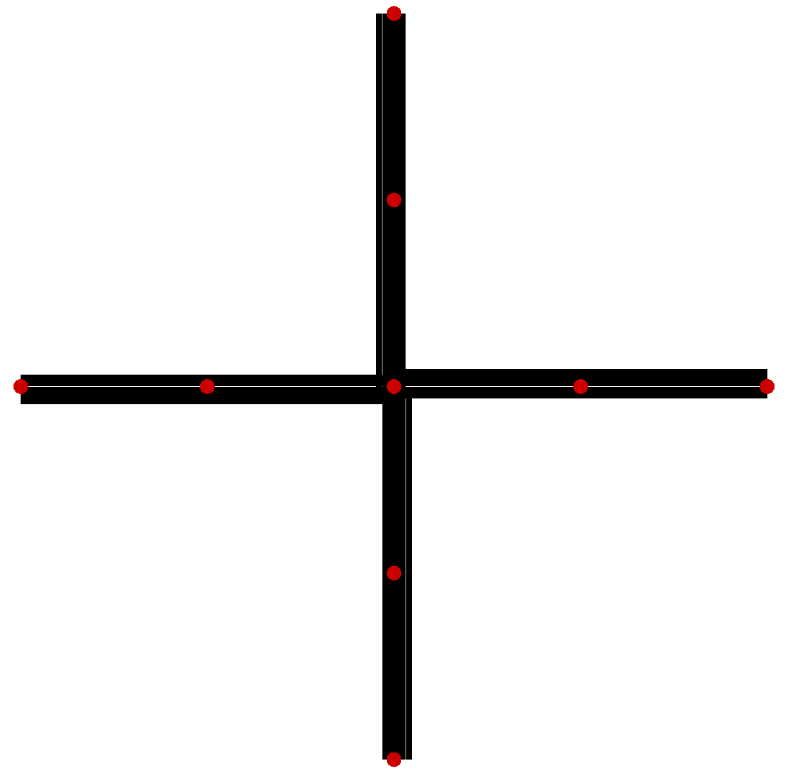
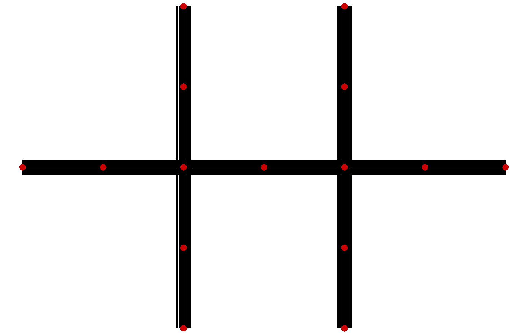

# Smart traffic with deep q learning

## Distributed Deep Reinforcement Learning Traffic Signal Control

## Installation

### Dependancies

- [Python](https://www.python.org/) 3.6
- [Ubuntu](https://www.ubuntu.com/) 18
- [Sumo](https://sourceforge.net/projects/sumo/) 1.1.0
- [Tensorflow](https://www.tensorflow.org/) 1.12 (optimized builds [here](https://github.com/lakshayg/tensorflow-build))
- [SciPy](https://www.scipy.org/)
- [Keras](https://keras.io/) 2.2.4

## Running the code

### Training

```
python run.py -nogui -save -mode train
```

To learn more about all input arguments, run `python run.py --help`.

After training has completed, execute:

```
python graph_actors.py
```


### Testing

To watch learned agents, execute:

```
python run.py -load -mode test -actor 1 -learner 1
```

## Overview

This framework takes a SUMO network simulation and develops deep reinforcement learning agents for each signalised intersection to act as optimal signal controllers. A [distributed actor/learner architecture](https://arxiv.org/abs/1803.00933) implemented with Python multiprocessing enables hardware scalability. This research implements [n-step Q-learning](https://arxiv.org/abs/1602.01783), an off-policy, value-based form of reinforcement learning. 


### Simulation

Two simple SUMO simulations are included, the first (`-netfp networks/single.net.xml -sumocfg networks/single.sumocfg`) with a single intersection:



and the second (default) with two intersections:



Vehicle generation is implemented in Vehicle.py class. Vehicles are generated uniform randomly over origin edges with their departure times into the network modelled as a Poisson process. SUMO subscriptions are used to optimize performance accessing vehicle data. Yellow and red phases are inserted between conflicting green phases, their duration controlled by `-yellow 4 -red 4`.

### Reinforcement Learning

The n-step Q-learning algorithm is used to train agents to implement acyclic, adaptive traffic signal control. An agent's policy selects the next green phase for a fixed duration. Green phases can be selected in an acyclic manner (i.e., no cycle). The fixed duration (i.e., action repeat) of the green phase is controlled with `-arepeat 15`. Smaller action repeats enable more frequent control but are likely more difficult to learn. The agent's state is a function of the density of all incoming intersection lanes. The reward is the negative cumulative delay of all vehicles on incoming lanes. The default deep neural network is a 2 hidden layer fully-connected architecture to model the action-value function, implemented in NeuralNetwork.py.

In `-mode train` the actors first execute until all experience replays are filled `-replay 10000`. Then actors continue to generate trajectories until learners perform sufficient batch updates `-updates 10000`. In `-mode test` the actors execute 1 simulation. 
